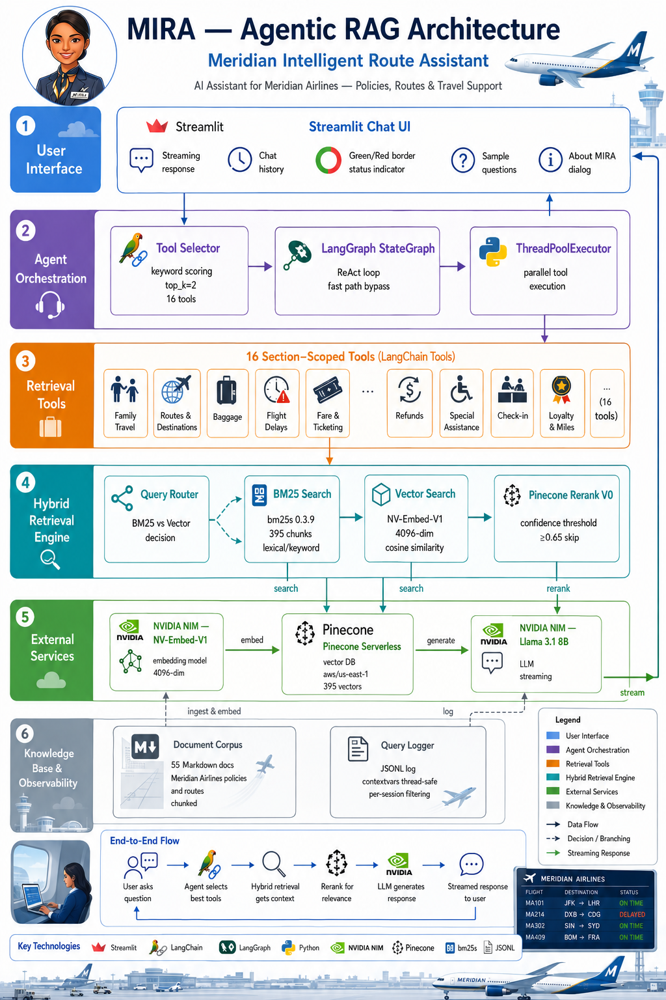

# MIRA — Meridian Intelligent Route Assistant
## Project Documentation

> **Version:** 1.0  
> **Last Updated:** June 2026  
> **Author:** Built with Claude Code (Anthropic)

---

## Table of Contents

1. [Project Overview](#1-project-overview)
2. [System Architecture](#2-system-architecture)
3. [Technology Stack](#3-technology-stack)
4. [Knowledge Base](#4-knowledge-base)
5. [Ingestion Pipeline](#5-ingestion-pipeline)
6. [Retrieval System](#6-retrieval-system)
7. [Agent System](#7-agent-system)
8. [User Interface](#8-user-interface)
9. [Query Logging & Observability](#9-query-logging--observability)
10. [Performance Characteristics](#10-performance-characteristics)
11. [Configuration & Environment](#11-configuration--environment)
12. [Project Directory Structure](#12-project-directory-structure)
13. [Running the Application](#13-running-the-application)
14. [Key Design Decisions & Trade-offs](#14-key-design-decisions--trade-offs)

---

## 1. Project Overview

MIRA (Meridian Intelligent Route Assistant) is a production-grade **Agentic Retrieval-Augmented Generation (RAG)** chatbot built for the fictional **Meridian Airlines**. It answers customer service questions — policies, baggage, routes, disruptions, loyalty programs, and more — exclusively from a curated corpus of internal airline documentation.

### Core Design Principles

| Principle | Implementation |
|---|---|
| **Grounded answers only** | MIRA never answers from model training data; every fact is retrieved from documents and cited inline |
| **Transparency** | Every response shows which tools were consulted and cites the source document, section, and effective date |
| **Sub-30s latency** | Fast-path parallel retrieval + single LLM call; Llama 3.1 8B chosen over 70B for speed |
| **Production-grade observability** | Full per-query trace log: tool selection, retrieval route, scores, rerank decision, response time |
| **Hybrid retrieval** | BM25 for exact-match/ID queries; vector for semantic queries; confidence-based reranking |

---

## 2. System Architecture



```
┌─────────────────────────────────────────────────────────────┐
│                    STREAMLIT CHAT UI                        │
│  (Chat history · Sample questions · Status border · Logs)   │
└──────────────────────────┬──────────────────────────────────┘
                           │ user query
                           ▼
┌─────────────────────────────────────────────────────────────┐
│                  TOOL SELECTOR                              │
│  Keyword scoring (top_k=2) + regex forced-inclusion         │
│  16 candidate tools → 2 selected per query                  │
└──────────┬──────────────────────────────────┬───────────────┘
           │                                  │
    Tool A (parallel)                  Tool B (parallel)
           │         ThreadPoolExecutor       │
           ▼                                  ▼
┌──────────────────────┐         ┌────────────────────────┐
│   LangChain Tool     │         │   LangChain Tool       │
│  (section-scoped)    │         │  (section-scoped)      │
└──────────┬───────────┘         └──────────┬─────────────┘
           │                                │
           ▼                                ▼
┌──────────────────────────────────────────────────────────────┐
│                  HYBRID RETRIEVER                            │
│                                                              │
│  ┌──────────────┐     ┌────────────────┐                    │
│  │ Query Router │────▶│  BM25 Search   │  (ID/flight-number │
│  │ (regex       │     │  bm25s 0.3.9   │   queries)         │
│  │  patterns)   │     │  395 chunks    │                    │
│  │              │────▶│ Vector Search  │  (semantic         │
│  └──────────────┘     │ NV-Embed-V1    │   queries)         │
│                       │ Pinecone       │                    │
│                       └───────┬────────┘                    │
│                               │                             │
│                    ┌──────────▼──────────┐                  │
│                    │  Pinecone Rerank V0  │                  │
│                    │  (skip if score      │                  │
│                    │   ≥ 0.65 cosine)    │                  │
│                    └──────────┬──────────┘                  │
└───────────────────────────────┼─────────────────────────────┘
                                │ top-3 chunks with citations
                                ▼
┌─────────────────────────────────────────────────────────────┐
│              NVIDIA NIM — Llama 3.1 8B Instruct             │
│   Single LLM call with full context (no multi-turn loop)    │
│   Streaming response with inline citations                   │
└─────────────────────────────────────────────────────────────┘
                                │ streaming tokens
                                ▼
                     Chat UI (token-by-token)
```

### Key Architectural Pattern: Fast Path

The agent uses a **fast-path pattern** rather than a traditional ReAct loop:

1. Pre-select 2 tools using keyword scoring (no LLM call needed)
2. Execute both tools **in parallel** using `ThreadPoolExecutor`
3. Concatenate retrieved context
4. Make **exactly one LLM call** with full context

This reduces LLM calls from 2–3 (sequential ReAct) to exactly 1, and retrieval runs in parallel rather than serially.

---

## 3. Technology Stack

### Core Frameworks & Libraries

| Category | Library | Version | Purpose |
|---|---|---|---|
| Agent Framework | LangGraph | ≥ 0.2.0 | StateGraph agent definition (fast path bypasses the graph) |
| LLM Integration | LangChain OpenAI | ≥ 0.2.0 | ChatOpenAI wrapper for NVIDIA NIM |
| Text Splitting | LangChain Text Splitters | ≥ 0.3.0 | `RecursiveCharacterTextSplitter` for document chunking |
| LLM Tools | LangChain Core | ≥ 0.2.0 | `@tool` decorator for 16 section-scoped tools |
| Lexical Search | bm25s | ≥ 0.2.0 | Fast BM25 indexing and retrieval (no Java dependency) |
| Vector Database | Pinecone | ≥ 5.0.0 | Serverless vector store + Rerank V0 |
| UI Framework | Streamlit | ≥ 1.40.0 | Chat UI, dialogs, session state |
| HTTP/API | OpenAI Python SDK | ≥ 1.0.0 | Communicates with NVIDIA NIM endpoints |
| Env Config | python-dotenv | ≥ 1.0.0 | `.env` file loading |
| Package Manager | uv | latest | Fast Python package management |
| Runtime | Python | ≥ 3.11 | Required for `str | None` union syntax, `match`, etc. |

### External Services

| Service | Model / Config | Purpose |
|---|---|---|
| NVIDIA NIM | `nvidia/nv-embed-v1` (4096-dim) | Document and query embedding |
| NVIDIA NIM | `meta/llama-3.1-8b-instruct` | Answer generation (streaming) |
| Pinecone Serverless | `meridian-airlines` index, `aws/us-east-1`, cosine similarity | Vector storage and ANN search |
| Pinecone Inference | `pinecone-rerank-v0` | Cross-encoder reranking |

### NV-Embed-V1 Configuration

```python
# Asymmetric embedding: documents use "passage" input type, queries use "query"
# This is critical for NV-Embed-V1's performance

# Ingestion (documents):
extra_body={"input_type": "passage", "truncate": "END"}

# Retrieval (queries):
extra_body={"input_type": "query", "truncate": "END"}
```

---

## 4. Knowledge Base

### Document Corpus

55 Markdown documents covering all major Meridian Airlines topics:

| Category | Documents | Topics |
|---|---|---|
| Booking & Reservations | 4 | General booking, modifications, name corrections, group bookings |
| Cancellations & Refunds | 4 | Economy cancellations, business/first cancellations, refund processing, no-show |
| Baggage | 4 | Carry-on, checked, excess fees, special items |
| Fare Classes & Ticketing | 4 | Fare guide, ticket validity, upgrades, waitlist/standby |
| Check-in & Boarding | 4 | Check-in procedures, boarding, seat selection, travel documents |
| Frequent Flyer Program | 4 | Earning, redemption, tier benefits, partner programs |
| Disruptions & Compensation | 4 | Delays, irregular operations, denied boarding, weather |
| Special Services | 4 | Special assistance, unaccompanied minors, medical clearance, special meals |
| Ancillary & Airport | 4 | Seat upgrades, lounge passes, in-flight services, priority services, lounge network, transfers, parking |
| Codeshare & Alliances | 3 | Codeshare partners, alliance benefits, interline agreements |
| Travel Requirements | 3 | Visa requirements, transit visa rules, health requirements |
| Family & Child Travel | 3 | Infant travel, child fares, family seating |
| Corporate Travel | 3 | Corporate accounts, fare benefits, travel management |
| Onboard Experience | 3 | Safety rules, medical emergencies, passenger conduct |
| Route Network | 1 | 5 hubs, 50+ routes, flight numbers, connection times |

### Document Format

Every document uses YAML frontmatter for structured metadata:

```markdown
---
doc_type: policy
topic: Baggage
subtopic: Checked Baggage
section: Baggage Policy
applies_to: all_passengers
effective_date: "2025-11-01"
---

## Checked Baggage Allowances
...
```

Frontmatter fields stored as Pinecone metadata: `doc_type`, `topic`, `subtopic`, `section`, `fare_class`, `route_type`, `passenger_type`, `applies_to`, `effective_date`, `tier_level`.

### Corpus Statistics

| Metric | Value |
|---|---|
| Total documents | 55 |
| Total chunks | 395 |
| Chunk size | 800 characters |
| Chunk overlap | 100 characters |
| Embedding dimensions | 4096 |
| Pinecone vectors | 395 |
| BM25 index size | 395 tokens |

---

## 5. Ingestion Pipeline

The ingestion pipeline processes raw Markdown documents into both a BM25 index and Pinecone vector index. It runs as a one-time (or re-run on update) offline process.

### Pipeline Steps

```
docs/*.md
    │
    ▼  Step 1: Load & Chunk
    │  chunker.py
    │  - Parse YAML frontmatter → extract metadata
    │  - RecursiveCharacterTextSplitter(chunk_size=800, overlap=100)
    │  - Separators: ["\n## ", "\n### ", "\n\n", "\n", " "]
    │  → list[Chunk] (dataclass with chunk_id, text, metadata fields)
    │
    ├──▶  Step 2: Build BM25 Index
    │     bm25_indexer.py
    │     - bm25s.tokenize(corpus, stopwords="en")
    │     - bm25s.BM25().index(tokenized)
    │     - Save to data/bm25_index/index
    │     - Save corpus_metadata.json (all chunk metadata)
    │
    └──▶  Step 3: Embed + Upload to Pinecone
          embedder.py → pinecone_uploader.py
          - Batch size: 32 chunks per API call
          - NVIDIA NIM NV-Embed-V1, input_type="passage"
          - Upsert vectors with full metadata to Pinecone
```

### Running the Ingestion

```bash
# Full corpus ingestion
uv run python -m src.ingestion.run_ingestion

# Single document ingestion (targeted update)
uv run python src/ingestion/ingest_single.py docs/guide_route_network.md
```

### Chunk Dataclass

```python
@dataclass
class Chunk:
    chunk_id: str          # e.g. "policy_baggage_chunk_0003"
    source_doc: str        # e.g. "policy_checked_baggage.md"
    text: str              # the actual content
    doc_type: str          # "policy" | "guide"
    topic: str             # e.g. "Baggage"
    section: str           # e.g. "Baggage Policy"
    effective_date: str    # e.g. "2025-11-01"
    # ... 8 more metadata fields
```

---

## 6. Retrieval System

The retrieval system is the core of MIRA's accuracy. It uses a hybrid approach combining lexical and semantic search, with intelligent routing and confidence-based reranking.

### 6.1 Query Router

**File:** `src/retrieval/router.py`

Routes queries to either BM25 or vector search based on whether they contain structured IDs:

```python
_ID_PATTERNS = [
    re.compile(r'\bMA-[A-Z0-9]{6}\b'),   # PNR:      MA-XKPL92
    re.compile(r'\bMA-\d{3,4}\b'),        # Flight:   MA-204
    re.compile(r'\bMA-\d{13}\b'),         # e-Ticket: MA-1762345678901
    re.compile(r'\bMA-\d{8}\b'),          # FFP acct: MA-88234410
    re.compile(r'\bMA[A-Z]{3}\d{5}\b'),   # Bag tag:  MADXB99999
    re.compile(r'\b[A-Z]{2}\d{3,4}\b'),   # Generic:  LH404
]
```

**Routing logic:** If any pattern matches → BM25 (exact match). Otherwise → Vector (semantic).

**Why:** Flight numbers, PNRs, and ticket IDs are exact strings. Embedding them and doing cosine search would lose precision. BM25 finds exact token matches reliably.

### 6.2 BM25 Retrieval

**File:** `src/retrieval/bm25_retriever.py`

- Uses `bm25s` library (pure Python, no Java/Elasticsearch required)
- Index loaded once at startup (singleton via module-level globals)
- English stopword removal during both indexing and querying
- Returns `list[RetrievalResult]` with BM25 relevance scores

```python
tokenized = bm25s.tokenize([query], stopwords="en")
raw_results, scores = _retriever.retrieve(tokenized, k=top_k)
```

### 6.3 Vector Retrieval

**File:** `src/retrieval/vector_retriever.py`

- Query is embedded using NVIDIA NIM `nv-embed-v1` with `input_type="query"`
- Pinecone ANN search with cosine similarity
- Supports **metadata filtering** — each tool passes its section as a filter:

```python
# Example: tool_baggage scopes retrieval to Baggage Policy only
pinecone_index.query(
    vector=embedding,
    top_k=8,
    include_metadata=True,
    filter={"section": "Baggage Policy"}
)
```

This metadata filtering is what makes tools section-scoped — the same vector index serves all 16 tools, but each filters to its own section of documents.

### 6.4 Hybrid Retrieval Orchestrator

**File:** `src/retrieval/hybrid_retriever.py`

Orchestrates the full retrieval pipeline:

```
retrieve(query, metadata_filter)
    │
    ├── route_query(query) → BM25 or VECTOR
    │
    ├── [BM25 path]
    │   ├── bm25_search(query, top_k=8)
    │   └── rerank(query, candidates, top_n=3)   ← always reranks
    │
    └── [Vector path]
        ├── vector_search(query, top_k=8, filter)
        ├── top_score = candidates[0].score
        │
        ├── [if score ≥ 0.65]  → return top-3 directly (skip rerank)
        │   "High confidence: reranking unnecessary"
        │
        └── [if score < 0.65]  → rerank(query, candidates, top_n=3)
```

**Confidence threshold (0.65):** NV-Embed-V1 cosine scores range 0.3–0.7. A score ≥ 0.65 indicates the top result is a strong semantic match; reranking is unlikely to change the order. This optimization saves ~900ms per query when triggered.

### 6.5 Pinecone Reranker

**File:** `src/retrieval/reranker.py`

- Uses `pinecone-rerank-v0` cross-encoder model
- Takes up to 8 candidate chunks, returns top 3 reordered by relevance
- Cross-encoders read query+document together (more accurate than bi-encoders)
- `return_documents=False` — returns indices into original results, not full text again

```python
reranked = pinecone_client.inference.rerank(
    model="pinecone-rerank-v0",
    query=query,
    documents=[r.text for r in results],
    top_n=3,
    return_documents=False,
)
```

---

## 7. Agent System

### 7.1 Tool Selector

**File:** `src/agent/tool_selector.py`

Pre-selects which 2 of the 16 tools to run, before any retrieval happens. This is pure Python (no LLM call), making it extremely fast (~1ms).

**Mechanism:**
1. Strip punctuation from query: `re.sub(r"[^\w\s]", "", query.lower())`
2. Tokenize by whitespace
3. Score each tool by counting keyword overlaps with its keyword set
4. Apply regex forced-inclusions (override score to 99 for guaranteed selection)
5. Return top-2 by score

**Forced inclusions (regex overrides):**

```python
_FORCED_TOOLS = [
    (re.compile(r'\b\d+[\s-]*(year|month|yr)s?[\s-]*old\b', re.I), "tool_family_travel"),
    (re.compile(r'\b(toddler|newborn|infant|baby|babies)\b', re.I), "tool_family_travel"),
    (re.compile(r'\b(son|daughter|kid|kids|toddler)\b', re.I), "tool_family_travel"),
]
```

These exist because keywords like "baby" or "2-year-old" would otherwise be missed by simple token matching.

**Fallback:** If fewer than 2 tools score > 0, fill remaining slots from top-ranked tools regardless of score. Default fallback tools: `tool_booking_reservations`, `tool_fare_ticketing`, `tool_cancellation_refunds`.

### 7.2 LangChain Tools (16 Tools)

**File:** `src/agent/tools.py`

Each tool is a `@tool`-decorated function that:
1. Accepts `query: str`
2. Calls `retrieve(query, metadata_filter={"section": "<SECTION_NAME>"})`
3. Formats results with source citations
4. Returns a formatted string for the LLM context

| Tool Name | Section Filter | Domain |
|---|---|---|
| `tool_routes` | Route Network | Destinations, hubs, flight numbers, connection times |
| `tool_booking_reservations` | Booking & Reservations | PNR, e-ticket, payment, group booking |
| `tool_cancellation_refunds` | Cancellations & Refunds | Cancel, refund, no-show, void |
| `tool_baggage` | Baggage Policy | Carry-on, checked, excess, special items |
| `tool_checkin_boarding` | Check-in & Boarding | Online check-in, boarding pass, gate |
| `tool_fare_ticketing` | Fare Classes & Ticketing | Economy Saver/Flex, Business, First, upgrades |
| `tool_frequent_flyer` | Frequent Flyer Program | Meridian Miles, tiers, earn/redeem |
| `tool_disruptions_compensation` | Disruptions & Compensation | Delays, cancellations, denied boarding |
| `tool_special_services` | Special Services | Wheelchair, UMNR, medical, dietary |
| `tool_ancillary_services` | Ancillary Services | Lounge passes, Wi-Fi, priority boarding |
| `tool_lounge_airport` | Airport Services | Lounge locations, transfers, parking |
| `tool_partnerships` | Codeshare & Alliances | Codeshare, interline, partner airlines |
| `tool_travel_requirements` | Travel Requirements | Visa, passport, health, vaccination |
| `tool_family_travel` | Family & Child Travel | Infants, lap baby, child fares, bassinets |
| `tool_corporate_travel` | Corporate Travel | Corporate accounts, negotiated fares, TMC |
| `tool_onboard_conduct` | Onboard Experience & Safety | Safety rules, conduct, medical emergencies |

### 7.3 Fast Path Agent

**File:** `src/agent/graph.py` — `stream_query()` function

The production code path. Bypasses the LangGraph ReAct loop entirely:

```python
def stream_query(query: str) -> Generator[str, None, None]:
    start_query(query)                          # 1. Start logging
    tool_names = select_tools(query, top_k=2)  # 2. Pre-select tools (keyword scoring)
    qid = get_current_query_id()               # 3. Capture query ID for worker threads

    def _run_tool(name: str) -> str:
        set_current_query_id(qid)              # Propagate ID into worker thread
        return ALL_TOOLS[name].invoke({"query": query})

    # 4. Execute tools in parallel
    active = [n for n in tool_names if n in ALL_TOOLS]
    with ThreadPoolExecutor(max_workers=len(active)) as pool:
        tool_outputs = list(pool.map(_run_tool, active))

    # 5. Single LLM call with all context
    context = "\n\n---\n\n".join(tool_outputs)
    llm = ChatOpenAI(model="meta/llama-3.1-8b-instruct", ...)
    messages = [SystemMessage(SYSTEM_PROMPT), HumanMessage(f"{query}\n\n[Context]\n{context}")]

    # 6. Stream response token by token
    for chunk in llm.stream(messages):
        if chunk.content:
            yield chunk.content

    end_query()                                # 7. End logging
```

**ContextVar propagation:** Python's `contextvars.ContextVar` is NOT automatically inherited by `ThreadPoolExecutor` worker threads in all Python versions. The fix: explicitly capture the query ID from the main thread and call `set_current_query_id(qid)` at the start of each worker function.

### 7.4 LangGraph Agent (Legacy / Fallback)

**File:** `src/agent/graph.py` — `build_graph()` and `stream_with_status()`

The original ReAct-style agent is still present but not used by the UI. It implements:
- `pre_select_tools` node: keyword-based tool pre-selection
- `call_model` node: LLM call with available tools bound
- `execute_tools` node: sequential tool execution
- Conditional edge: continue if tool calls, end if text response
- Loop prevention: tracks `already_called` tools, forces final answer at MAX_ITERATIONS=6

### 7.5 System Prompt

**File:** `src/agent/prompts.py`

Key constraints enforced by the prompt:
- **Never answer from model knowledge** — only from retrieved context
- **Never output a bare citation** — every citation must accompany actual answer text
- **Inline citation format:** `[Source: <file> | Section: <section> | Effective: <date>]`
- **Fallback:** if context lacks information, direct user to +1-800-637-4326 or www.meridianair.com
- **Format:** 1–2 sentence direct answer → bullet details → inline citations

---

## 8. User Interface

**File:** `src/ui/app.py`

Built with Streamlit 1.x. Key UI features and implementation techniques:

### 8.1 Layout

```
┌─────────────────────┬──────────────────────────────────────┐
│   SIDEBAR (left)    │  FIXED HEADER (always visible)        │
│                     │  ✈️ Meridian Airlines                  │
│  MIRA avatar        │  Where Every Journey Matters          │
│  ✨ MIRA ✨          ├──────────────────────────────────────┤
│  Meridian IAR        │                                      │
│  ─────────          │  [Try Asking] sample questions        │
│  ⚡ Powered by...   │  (hidden after first message)         │
│  📚 Grounded...     │                                      │
│  ─────────          │  ┌────────────────────────────────┐  │
│                     │  │ 👤 User message bubble          │  │
│                     │  └────────────────────────────────┘  │
│                     │  ┌────────────────────────────────┐  │
│  [contact block]    │  │ 🤖 MIRA response with citations │  │
│  ✈️ Meridian        │  └────────────────────────────────┘  │
│  🌐 website         │                                      │
│  📧 email           ├──────────────────────────────────────┤
│  📞 phone           │  [MIRA avatar] [chat input box]   [→] │
│  📍 address         │  (green border = ready)               │
│                     │  (red border = processing)            │
│  [About MIRA]       │                                      │
└─────────────────────┴──────────────────────────────────────┘
```

### 8.2 Key UI Techniques

| Feature | Implementation |
|---|---|
| **Fixed header** | `position: fixed; top: 0; left: 21rem; right: 0` — starts after sidebar width |
| **Seamless header background** | `background-attachment: fixed` with same image as app — visually seamless, no visible box |
| **Sidebar shadow** | `box-shadow: 4px 0 16px rgba(0,0,0,0.18)` on `section[data-testid="stSidebar"]` |
| **Chat border status** | Green `#22c55e` (idle) injected at top; red `#ef4444` injected as override inside `if query:` block |
| **MIRA avatar in chat input** | CSS `::before` pseudo-element on `[data-testid="stChatInput"]` with base64 image |
| **Chat bubble backgrounds** | `[data-testid="stChatMessageContent"]` gets `rgba(255,255,255,0.96)` — prevents app background bleeding through |
| **Chat input bar background** | `[data-testid="stBottom"]` styled to match sidebar `rgb(240,242,246)` |
| **Sample questions** | `st.empty()` placeholder, cleared immediately on first query submission |
| **Inline citation styling** | Regex replaces `[Source: ...]` with `<span style="...monospace grey...">` |
| **Streaming** | `st.empty()` placeholder updated token-by-token with `▌` cursor appended |
| **About MIRA dialog** | `@st.dialog("About MIRA", width="large")` with Architecture + Query Logs tabs |
| **Pinned sidebar elements** | `position: fixed; bottom: Xrem; left: 1rem; width: 290px` for button and contact block |

### 8.3 Background Image

The app background uses a custom image with a near-opaque gray overlay:

```css
[data-testid="stAppViewContainer"] {
    background-image:
        linear-gradient(rgba(240,240,240,0.94), rgba(240,240,240,0.94)),
        url("data:image/png;base64,...");
    background-attachment: fixed;
}
```

The 0.94 opacity overlay keeps the image subtle while maintaining readability. The same CSS is used on the fixed header to ensure the backgrounds are perfectly seamless.

### 8.4 Sample Questions

```python
_SAMPLE_QUERIES = [
    "Can I cancel my Economy Saver ticket?",
    "How many kg of baggage in Business class?",
    "My flight MA-204 was delayed 4 hours — what am I owed?",
    "How do I earn Meridian Miles on partner flights?",
    "Can I bring my infant on board without a seat?",
    "What documents do I need to check in?",
    "What is the lounge access policy for Gold members?",
    "Do I need a visa to transit through a Meridian hub?",
]
```

Shown in a 2-column grid on the welcome screen. Disappear on first query (cleared via `st.empty()`), never return until page refresh.

---

## 9. Query Logging & Observability

**File:** `src/utils/query_logger.py`

### Architecture

Every query generates a sequence of JSONL events in `logs/query_log.jsonl`:

```jsonl
{"query_id": "4d80775a", "event": "query_start", "timestamp": "2026-06-09 01:10:20", "query": "Can my infant travel?"}
{"query_id": "4d80775a", "event": "tool_selection", "timestamp": "2026-06-09 01:10:20", "tools": ["tool_family_travel", "tool_booking_reservations"]}
{"query_id": "4d80775a", "event": "retrieval", "timestamp": "2026-06-09 01:10:26", "route": "vector", "top_score": 0.4786, "reranked": true, "results_returned": 3}
{"query_id": "4d80775a", "event": "retrieval", "timestamp": "2026-06-09 01:10:27", "route": "vector", "top_score": 0.3912, "reranked": true, "results_returned": 3}
{"query_id": "4d80775a", "event": "query_end", "timestamp": "2026-06-09 01:10:31", "response_time_s": 10.52}
```

### Thread-Safety via ContextVar

```python
_current_query_id: ContextVar[str] = ContextVar("current_query_id", default="")
_query_start_time: ContextVar[float] = ContextVar("query_start_time", default=0.0)
```

`ContextVar` provides thread-local-like storage without the overhead. When `ThreadPoolExecutor` spawns worker threads for parallel tool execution, the query ID is explicitly propagated:

```python
qid = get_current_query_id()   # read in main thread

def _run_tool(name: str) -> str:
    set_current_query_id(qid)  # write into worker thread's context
    ...
```

### Session Filtering

The About MIRA dialog shows only current-session queries by recording `session_start` in Streamlit session state at startup and filtering:

```python
load_queries(since=st.session_state.session_start)
# Filters: q["timestamp"] >= since
```

### What Gets Logged Per Query

| Event | Data |
|---|---|
| `query_start` | timestamp, query text |
| `tool_selection` | list of selected tool names |
| `retrieval` | route (bm25/vector), top cosine score, reranked (bool), result count |
| `query_end` | total response time in seconds |

---

## 10. Performance Characteristics

### Benchmarked Latency (June 2026)

| Component | Latency |
|---|---|
| Tool selection (keyword scoring) | ~1ms |
| NV-Embed-V1 embedding | ~5,400ms |
| Pinecone vector search | ~1,700ms |
| Pinecone reranker | ~900ms |
| Llama 3.1 8B time-to-first-token | ~1,000ms |
| **Total (parallel retrieval + LLM)** | **~8–11s end-to-end** |

### Why Llama 3.1 8B over 3.3 70B

During load testing, `meta/llama-3.3-70b-instruct` on NVIDIA NIM was measuring **87,000–293,000ms** time-to-first-token due to shared infrastructure load. `meta/llama-3.1-8b-instruct` delivers **~1,000ms** TTFT, bringing total response time well within the 30-second target.

For a grounded RAG system where the answer comes from retrieved documents (not model knowledge), a smaller model with faster inference is preferred over a larger model with better "world knowledge."

### Optimisations Applied

| Optimisation | Saving |
|---|---|
| Fast path (1 LLM call vs 2-3 in ReAct) | Eliminates 1–2 LLM calls |
| Parallel tool execution (ThreadPoolExecutor) | Retrieval time = max(tools) not sum(tools) |
| Confidence-based rerank skip (score ≥ 0.65) | Saves ~900ms when triggered |
| top_k=2 tools (down from 3) | Reduces unnecessary retrieval |
| Candidate reduction: top_k=8, top_n=3 | Fewer vectors retrieved and reranked |

---

## 11. Configuration & Environment

### Environment Variables (`.env`)

```env
NVIDIA_API_KEY=nvapi-...          # NVIDIA NIM API key
PINECONE_API_KEY=pcsk_...         # Pinecone API key
PINECONE_INDEX_NAME=meridian-airlines  # Pinecone index name
GENERATION_MODEL=meta/llama-3.1-8b-instruct  # Overridable LLM model
```

### Configurable Constants

| File | Constant | Default | Purpose |
|---|---|---|---|
| `chunker.py` | `CHUNK_SIZE` | 800 | Characters per chunk |
| `chunker.py` | `CHUNK_OVERLAP` | 100 | Overlap between adjacent chunks |
| `embedder.py` | `BATCH_SIZE` | 32 | Chunks per embedding API call |
| `hybrid_retriever.py` | `_CANDIDATE_K` | 8 | Candidates fetched before reranking |
| `hybrid_retriever.py` | `_TOP_N` | 3 | Final results returned after reranking |
| `hybrid_retriever.py` | `_RERANK_CONFIDENCE_THRESHOLD` | 0.65 | Skip rerank above this cosine score |
| `graph.py` | `MAX_ITERATIONS` | 6 | Max LangGraph loop iterations (legacy) |
| `tool_selector.py` | `top_k` | 2 | Tools selected per query |

---

## 12. Project Directory Structure

```
agentic-rag/
│
├── .env                          # API keys (not committed)
├── pyproject.toml                # Project metadata and dependencies
├── uv.lock                       # Locked dependency versions
├── PROJECT_DOCUMENTATION.md     # This file
│
├── docs/                         # 55 Markdown knowledge base documents
│   ├── policy_*.md               # Policy documents (cancellation, baggage, etc.)
│   └── guide_*.md                # Guide documents (check-in, FFP, routes, etc.)
│
├── data/
│   └── bm25_index/
│       ├── index.*               # Serialised BM25 index files (bm25s format)
│       └── corpus_metadata.json  # All chunk metadata (source, section, dates)
│
├── logs/
│   └── query_log.jsonl           # Append-only query trace log
│
└── src/
    ├── __init__.py
    │
    ├── ingestion/                # Offline data pipeline
    │   ├── chunker.py            # YAML frontmatter parser + RecursiveCharacterTextSplitter
    │   ├── embedder.py           # NVIDIA NIM NV-Embed-V1 batch embedder
    │   ├── bm25_indexer.py       # bm25s index builder and serialiser
    │   ├── pinecone_uploader.py  # Pinecone vector upsert
    │   ├── run_ingestion.py      # Full pipeline entry point
    │   └── ingest_single.py      # Single-document targeted ingestion
    │
    ├── retrieval/                # Online retrieval layer
    │   ├── types.py              # RetrievalResult dataclass, RetrievalRoute enum
    │   ├── router.py             # BM25 vs vector routing (regex ID patterns)
    │   ├── bm25_retriever.py     # BM25 search (singleton index)
    │   ├── vector_retriever.py   # NVIDIA NIM embedding + Pinecone ANN search
    │   ├── reranker.py           # Pinecone Rerank V0 cross-encoder
    │   └── hybrid_retriever.py   # Orchestrates router + retrieval + rerank
    │
    ├── agent/                    # Agent and LLM layer
    │   ├── tools.py              # 16 @tool-decorated LangChain tools
    │   ├── tool_selector.py      # Keyword scoring tool pre-selector
    │   ├── prompts.py            # MIRA system prompt
    │   ├── graph.py              # LangGraph graph + fast-path stream_query()
    │   └── run_agent.py          # CLI entry point for agent testing
    │
    ├── ui/                       # Streamlit frontend
    │   ├── app.py                # Main application (chat UI, sidebar, dialogs)
    │   └── assets/
    │       ├── mira_new.PNG           # MIRA avatar image
    │       ├── mira_background.png   # App background image
    │       └── MIRA_architecture.png # System architecture diagram
    │
    └── utils/                    # Shared utilities
        ├── __init__.py
        └── query_logger.py       # ContextVar-based JSONL query tracer
```

---

## 13. Running the Application

### Prerequisites

- Python 3.11+
- `uv` package manager (`pip install uv`)
- NVIDIA NIM API key
- Pinecone API key with a serverless index named `meridian-airlines` (4096-dim, cosine)

### Setup

```bash
# Clone / navigate to project
cd agentic-rag

# Install dependencies
uv sync

# Configure environment
cp .env.example .env
# Edit .env with your NVIDIA_API_KEY and PINECONE_API_KEY
```

### Run Ingestion (one-time)

```bash
uv run python -m src.ingestion.run_ingestion
```

This chunks all 55 documents, builds the BM25 index, embeds everything via NVIDIA NIM, and uploads 395 vectors to Pinecone.

### Start the Chatbot

```bash
uv run streamlit run src/ui/app.py --server.port 8502
```

Open `http://localhost:8502` in your browser.

### Test the Agent via CLI

```bash
uv run python -m src.agent.run_agent
```

---

## 14. Key Design Decisions & Trade-offs

### 14.1 Chunks-as-Tools Pattern

Each of the 16 LangChain tools maps to a specific **section** of the document corpus. Instead of one generic retrieval tool that searches everything, each tool scopes Pinecone queries to a specific `section` metadata filter.

**Benefit:** Precise retrieval — querying for baggage policy only returns baggage chunks, not unrelated sections with incidentally similar text.  
**Trade-off:** Requires a pre-selection step (Tool Selector) to decide which tool(s) to use, adding a keyword-matching step to the pipeline.

### 14.2 Hybrid BM25 + Vector Retrieval

**BM25 (lexical):** Best for exact matches — flight numbers like `MA-204`, booking references like `MA-XKPL92`, ticket numbers. Vector search on these ID strings would find semantically similar text (e.g., other flight numbers) rather than exact matches.

**Vector (semantic):** Best for conversational queries — "what happens if my flight is late?" doesn't share keywords with "delay compensation policy" but is semantically close.

**Routing choice:** Rather than always running both and merging (expensive), the router picks one path based on simple regex matching. This is deterministic and fast.

### 14.3 Confidence-Based Rerank Skip

Pinecone Rerank V0 adds ~900ms. For high-confidence matches (cosine ≥ 0.65), the top candidate is already the correct document, so reranking is wasted compute. The threshold was calibrated for NV-Embed-V1's score range (0.3–0.7).

### 14.4 Fast Path vs ReAct Loop

The traditional ReAct agent (observe → think → act → repeat) makes 2–3 sequential LLM calls per query. At 1s per LLM call, that's 2–3s in LLM time alone. The fast path:
1. Uses **zero** LLM calls for tool selection (keyword scoring instead)
2. Runs retrieval tools in **parallel** (not serial)
3. Makes **exactly one** LLM call with all context

For a well-structured domain (airline policies, bounded topic space), the keyword-based tool selector performs comparably to an LLM-based selector at a fraction of the cost.

### 14.5 Llama 3.1 8B over 70B

For a grounded RAG system, the answer quality depends primarily on:
1. Retrieval precision (finding the right chunks) — handled by the retrieval layer
2. Answer synthesis (summarising retrieved text) — where model size matters

An 8B model is fully capable of synthesising and paraphrasing retrieved airline policy text. The 70B model's advantage is in reasoning over complex, ambiguous questions — which are rare in a constrained customer service domain.

Result: 87x faster TTFT (1s vs 87s), no meaningful quality loss for this use case.

---

*MIRA — Meridian Intelligent Route Assistant*  
*Built on Agentic RAG · Grounded answers from official Meridian Airlines documentation*
